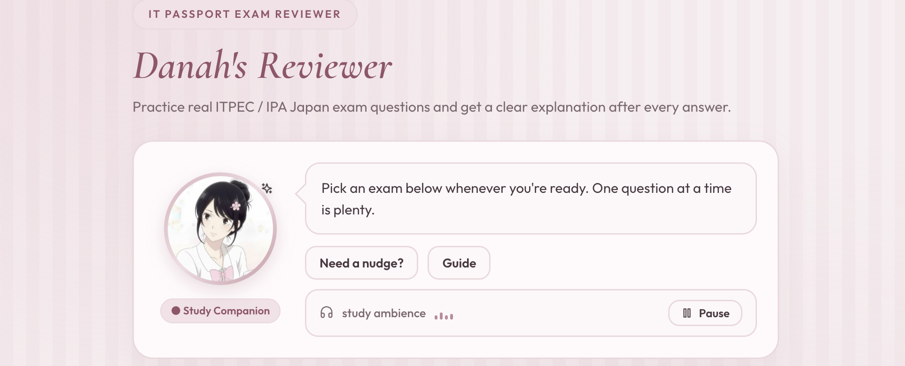
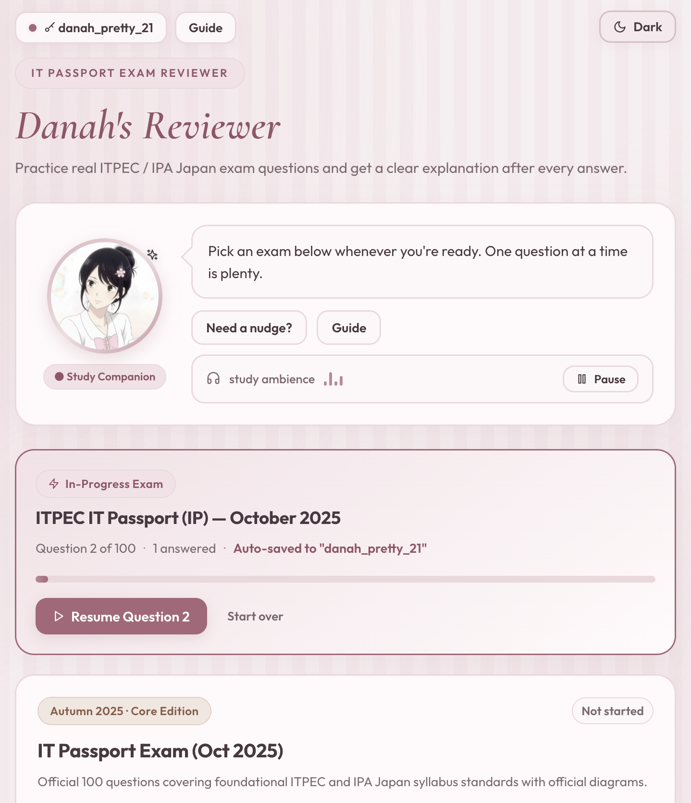
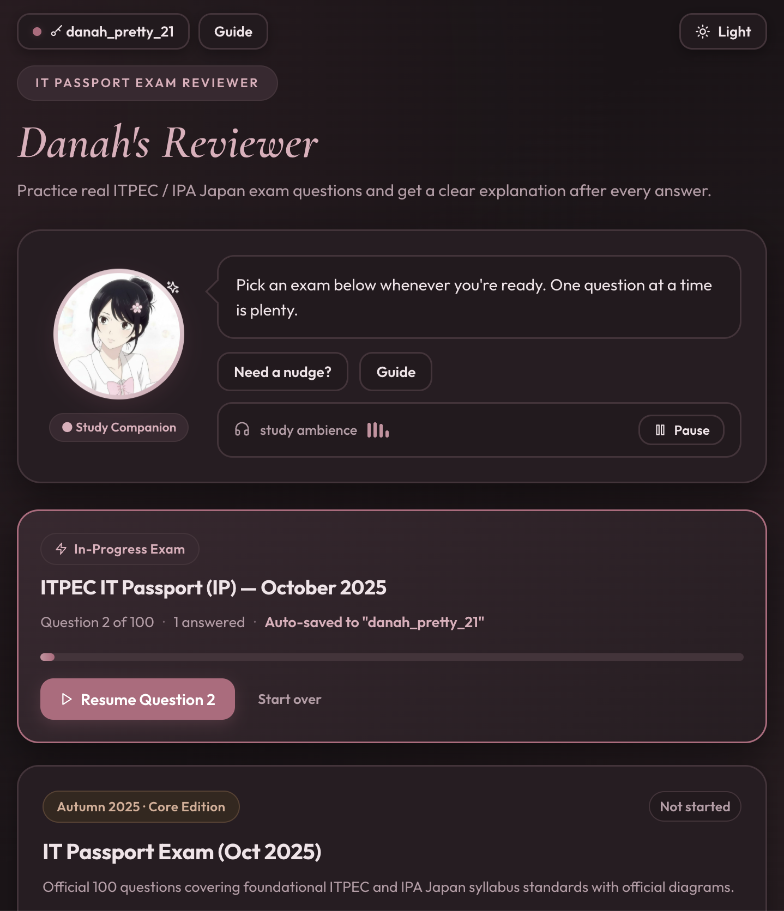
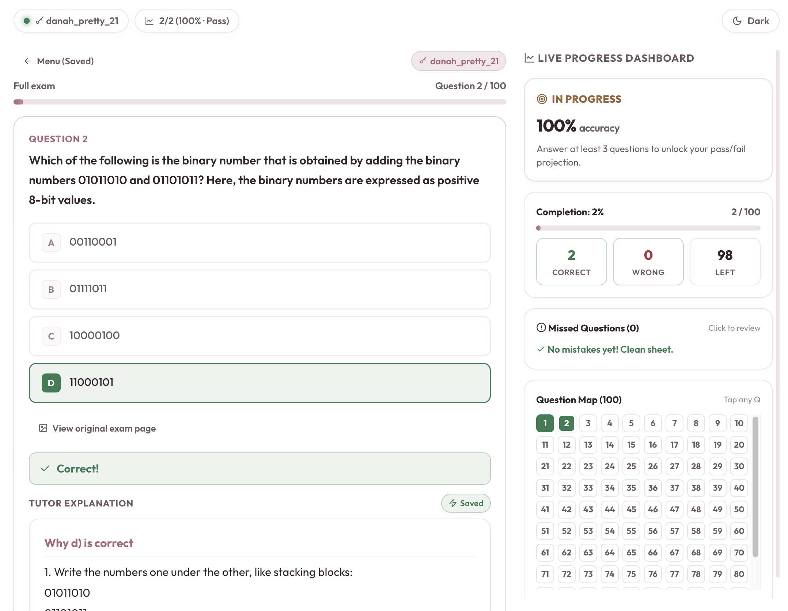
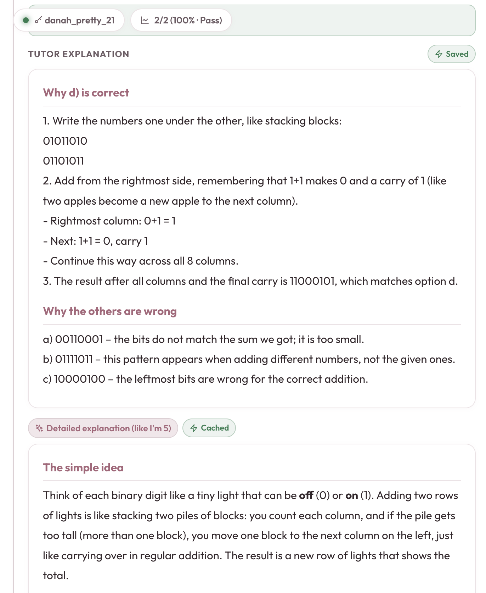
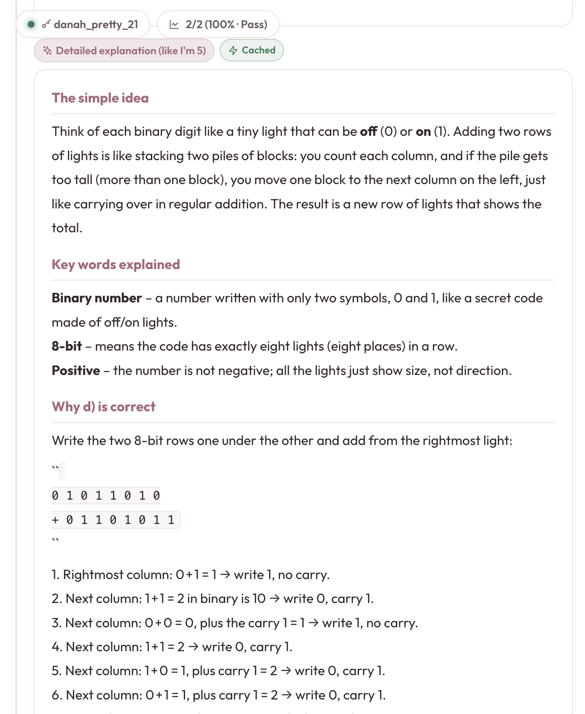

<p align="center">
  
</p>

<h1 align="center">🎀 Danah's IT Passport Reviewer</h1>

<p align="center">
  <em>An AI-guided, interactive exam reviewer for the ITPEC / IPA Japan IT Passport (IP) exam — built because studying shouldn't feel like a chore.</em>
</p>

<p align="center">
  <a href="https://itpassportreviewer.vercel.app/">🌸 Live Site → itpassportreviewer.vercel.app</a>
</p>

<p align="center">
  
  
  
  
</p>

---

## 🌷 The Story Behind It

Online IT Passport reviewers exist — but they're painfully boring. You scroll through pages of questions, get sleepy halfway through, and when you finally want to check your answer, you have to flip to the answer key, look up why it's correct, copy-paste the term into Google, and cross-reference it somewhere else. It's just **too much work** for something that should be fun to study.

So I built my own. 💪

**Before:** copy-paste a question → search Google → read a long article → try to piece together why option D was correct → forget it anyway.

**After:** click an answer → instantly see if you're right → get a full AI explanation, broken down step-by-step, *like you're 5 years old* → remember it forever. ✨

Paired with a **cute pink UI** that matches my aesthetic, lofi music ambience to keep me in the zone, and real-time stats so I can track exactly which questions I keep getting wrong — this is the reviewer I actually *want* to open.

---

## 🎀 Screenshots

<table>
  <tr>
    <td align="center" width="50%">
      
      <br/><sub><b>🌸 Home — Light Mode</b></sub>
    </td>
    <td align="center" width="50%">
      
      <br/><sub><b>🌙 Home — Dark Mode</b></sub>
    </td>
  </tr>
  <tr>
    <td align="center" width="50%">
      
      <br/><sub><b>🧠 Quiz UI with Live Progress Dashboard</b></sub>
    </td>
    <td align="center" width="50%">
      
      <br/><sub><b>✨ AI Tutor — Why each answer is right or wrong</b></sub>
    </td>
  </tr>
  <tr>
    <td align="center" colspan="2">
      
      <br/><sub><b>🎀 Detailed Explanation — Explain Like I'm 5</b></sub>
    </td>
  </tr>
</table>

---

## ✨ Features

### 🤖 AI-Powered Explanations (Powered by Google Gemini)
After answering every question, Gemini AI generates:
- **Why your chosen answer is correct or wrong** — not just a verdict, but a real breakdown
- **Why each of the other choices is incorrect** — so you understand the logic, not just memorize the letter
- **"Explain Like I'm 5" mode** — a second, deeper explanation using simple analogies, key vocabulary definitions, and step-by-step reasoning so concepts actually stick

No more copy-pasting to Google. No more flipping through PDFs. Just click and learn. 🌸

### 📖 Original Exam Page Viewer
Every question links back to its **original scanned exam page** (the actual PDF page as a JPG). This is crucial for questions with tables, graphs, and diagrams that don't convert cleanly to plain text — you always have the source to fall back on.

### 📊 Live Progress Dashboard
While answering, a sidebar shows:
- ✅ Correct / ❌ Wrong / 📋 Left counts
- Live **accuracy percentage**
- **Pass/Fail projection** (unlocks after 3 answered)
- A **question map** (100 tiles) showing your status on each question at a glance — tap any to jump directly to it
- **Missed Questions** tracker — see which ones you got wrong so you can retry them

### 🔁 Retry Mode
After finishing an exam, you can retry **only the questions you missed** — no need to redo the whole 100-question set every time.

### 💾 Session Keys & Progress Sync
Progress is saved under a named **session key** in `localStorage`. You can:
- Create multiple keys (e.g., one per device or study session)
- **Export** your progress as a JSON file
- **Import** it on another device — study seamlessly across phone and laptop

### 🎵 Lo-fi Study Ambience
A built-in lofi music player lives in the homepage companion card. Press play to set the study mood — animated bars show it's vibing. 🎧

### 🌙 Dark Mode
Full dark mode toggle — because studying at midnight requires it.

### ⌨️ Keyboard Shortcuts
- Press **A / B / C / D** to select an answer
- Press **Enter or →** to go to the next question

---

## 📚 Available Exams

| Exam | Questions | Season |
|------|-----------|--------|
| 🍂 IT Passport — October 2025 | 100 | Autumn 2025 · Core Edition |
| 🌸 IT Passport — April 2025 | 100 | Spring 2025 · Core Edition |
| 🌿 IT Passport — April 2026 | 100 | Spring 2026 · Latest Edition |

All exams are sourced from official **ITPEC exam form PDFs** and answer keys, then transformed into structured, interactive reviewers.

---

## 🛠️ Tech Stack

| Layer | Technology |
|-------|-----------|
| Frontend | Vanilla HTML + CSS + JavaScript (zero frameworks) |
| Styling | Custom CSS design system — rose/blush palette, glassmorphism, dark mode tokens |
| Typography | Google Fonts — Outfit, Plus Jakarta Sans, Cormorant Garamond |
| AI Explanations | Google Gemini API (`gemini-2.5-flash`) via Vercel Serverless Functions |
| Deployment | Vercel (auto-deploy on push to `main`) |
| Data | Static `questions.json` — flat file, no database needed |
| Session Storage | Browser `localStorage` + JSON export/import |

---

## 🗂️ Project Structure

```
itpassport/
├── public/
│   ├── index.html          # The entire app (single-page)
│   ├── questions.json      # All exam data (questions, options, answers)
│   ├── pages/              # Scanned exam page images
│   │   ├── 2025-oct/       # p-03.jpg … p-36.jpg
│   │   ├── 2025-apr/       # p-01.jpg … p-37.jpg
│   │   └── 2026-apr/       # p-03.jpg … p-37.jpg
│   └── images/             # README & UI screenshots
├── api/
│   ├── explain.js          # Serverless function → Gemini AI
│   └── session.js          # Serverless function → session helpers
├── exam_reviewers/         # Source exam JSONs + page images (per exam)
│   ├── april2025S/
│   ├── exam_2026/
│   └── 2018A_IP/
└── vercel.json             # Routing config
```

---

## ➕ Adding a New Exam

1. Create a new folder under `exam_reviewers/` with your exam JSON (see existing ones for the shape)
2. Run the helper script from the project root:
   ```bash
   node exam_reviewers/<folder>/add-exam.mjs exam_reviewers/<folder>/exam-XXXX-XXX.json
   ```
   This merges the exam into `public/questions.json` automatically (makes a `.bak` backup first).
3. Copy page images to `public/pages/<exam-id>/` as `p-01.jpg`, `p-02.jpg`, etc.
4. Push → Vercel redeploys in ~1 minute ✨

---

## 🔐 Environment Variables

| Variable | Required | Default | Notes |
|----------|----------|---------|-------|
| `GEMINI_API_KEY` | ✅ Yes | — | Get one free at [Google AI Studio](https://aistudio.google.com/) |
| `GEMINI_MODEL` | ❌ No | `gemini-2.5-flash` | Any Gemini model name |

---

## 💌 Made with love by

**Danah Paris** 🎀

> *"I made this so I'd actually enjoy studying. Turns out, when you understand why an answer is right instead of just memorizing it — you actually remember it."*

---

<p align="center">
  <sub>🌸 Built for the ITPEC IT Passport exam · Powered by Google Gemini · Deployed on Vercel 🌸</sub>
</p>
